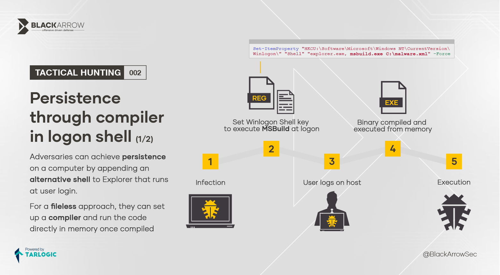
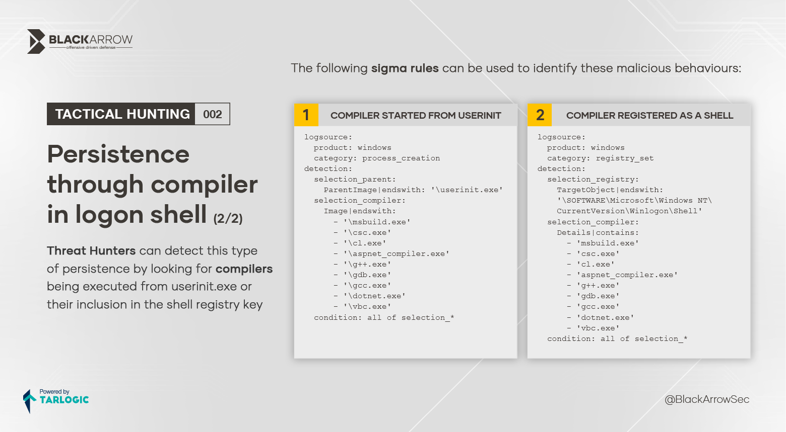

# Persistence through compiler in logon shell




## Sigma rules

### COMPILER STARTED FROM USERINIT
```yaml
logsource:
  product: windows
  category: process_creation
detection:
  selection_parent:
    ParentImage|endswith: '\userinit.exe'
  selection_compiler:
    Image|endswith:
      - '\msbuild.exe'
      - '\csc.exe'
      - '\cl.exe'
      - '\aspnet_compiler.exe'
      - '\g++.exe'
      - '\gdb.exe'
      - '\gcc.exe'
      - '\dotnet.exe'
      - '\vbc.exe'
  condition: all of selection_*
```

### COMPILER REGISTERED AS A SHELL
```yaml
logsource:
  product: windows
  category: registry_set
detection:
  selection_registry:
    TargetObject|endswith: '\SOFTWARE\Microsoft\Windows NT\CurrentVersion\Winlogon\Shell'
  selection_compiler:
    Details|contains: 
      - 'msbuild.exe'
      - 'csc.exe'
      - 'cl.exe'
      - 'aspnet_compiler.exe'
      - 'g++.exe'
      - 'gdb.exe'
      - 'gcc.exe'
      - 'dotnet.exe'
      - 'vbc.exe'
  condition: all of selection_*
```
