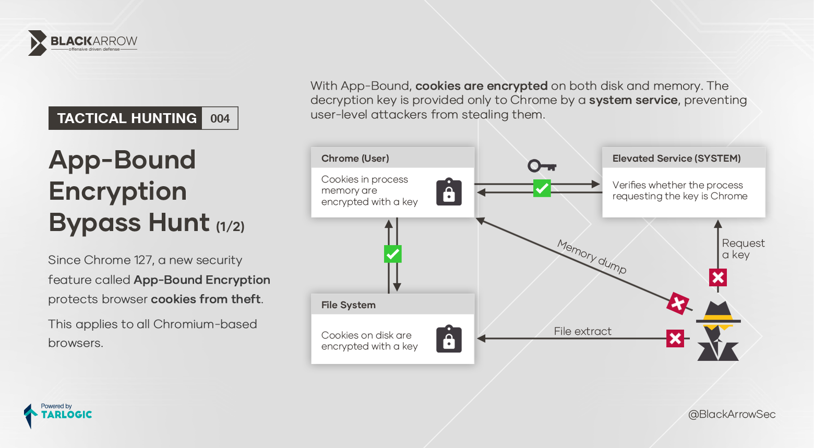
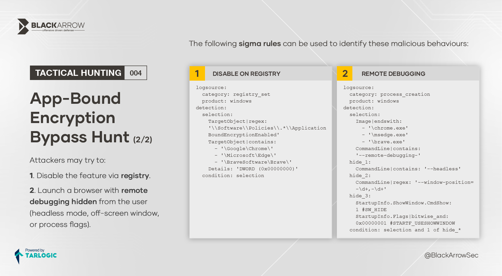

# App-bound encryption bypass hunt




## Sigma rules

### DISABLE ON REGISTRY
```yaml
logsource:
  category: registry_set
  product: windows
detection:
  selection:
    TargetObject|regex: '\\Software\\Policies\\.*\\ApplicationBoundEncryptionEnabled'
    TargetObject|contains:
      - '\Google\Chrome\'
      - '\Microsoft\Edge\'
      - '\BraveSoftware\Brave\'
    Details: 'DWORD (0x00000000)'
  condition: selection
```

### REMOTE DEBUGGING
```yaml
logsource:
  category: process_creation
  product: windows
detection:
  selection:
    Image|endswith:
      - '\chrome.exe'
      - '\msedge.exe'
      - '\brave.exe'
    CommandLine|contains: '--remote-debugging-'
  hide_1:
    CommandLine|contains: '--headless'
  hide_2:
    CommandLine|regex: '--window-position=-\d+,-\d+'
  hide_3:
    StartupInfo.ShowWindow.CmdShow: 1 #SW_HIDE
    StartupInfo.Flags|bitwise_and: 0x00000001 #STARTF_USESHOWWINDOW
  condition: selection and 1 of hide_*
```